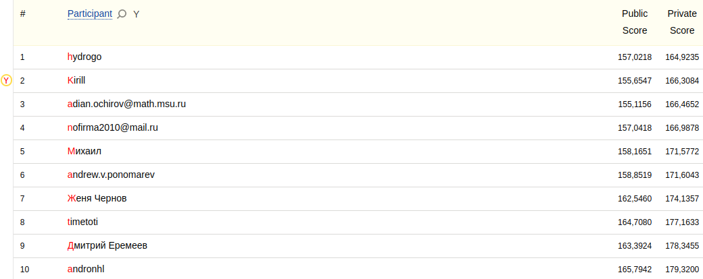
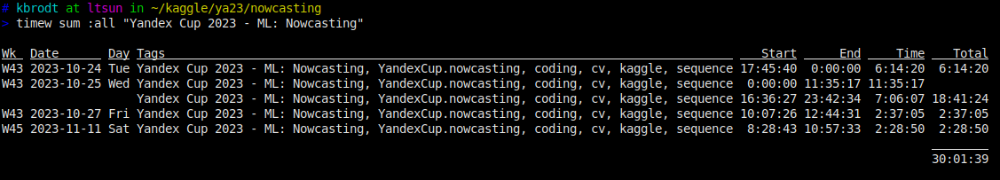

# Yandex Cup 2023 Machine Learning Challenge: Nowcasting

- [Yandex Cup 2023 Machine Learning Challenge](https://yandex.com/cup/ml/)

[Yandex Cup 2023 Machine Learning Challenge: Nowcasting](https://contest.yandex.com/contest/54252/problems/)
Develop AI model for nowcasting.

[2nd place](https://contest.yandex.com/contest/54252/standings/)
out of 89 participants with 166.3084 RMSE (top1 164.9235, top3 166.4652).



Time spent



## Approach

The approach is based on an UNet model. The inputs to the encoder are 4
previous channel-wise stacked frames with resolution of 252x252 of intensities,
events, first 4 reflectivity levels and month. We normalize inputs with min-max
scaler. The outputs are intensities for the next 2 hours (12 frames). We
directly optimize RMSE using AdamW optimizer and CosineAnnelingLR scheduler. We
use vertical flips, rotations as augmentations.

## Highlights

- unet model
- channel-wise stacked 4 previous frames (intensity, events, reflectivity)
- outputs intensity for the next 2 hours (12 frames)
- rmse loss
- random flips and rotations augmentations
- left-right and up-down flips test time augmentations

## Prerequisites & Hardware

- Ubuntu 20.04.6 LTS (GNU/Linux 5.4.0-125-generic x86_64)
- [Python 3.8.10](https://www.python.org/) (GCC 9.4.0)
- Nvidia driver version: 515.65.01
- CUDA version: 11.8
- NVIDIA Tesla V100-SXM2 32GB
- [PyTorch 2.0.1](https://pytorch.org/)
- Intel(R) Xeon(R) Gold 6148 CPU @ 2.40GHz
- 64 GB RAM

## Setup & Inference

Download the data from the competition page and unzip into `data` folder. Then
download pretrained models from [yandex disk](https://yadi.sk/d/4BJHVGlpsV5iew).

Run the script to produce the submission

```bash
sh ./submit.sh
```

The inference takes ~1 minute on 1 GPU V100 32GB.

## Train

To train a model from scratch

```bash
sh ./run.sh
```

It takes ~39 hours on 1 V100 to train all the models. Actually, the models are
trained faster (4-8 epochs), so you may stop earlier and reduce overall time to
~12 hours.
